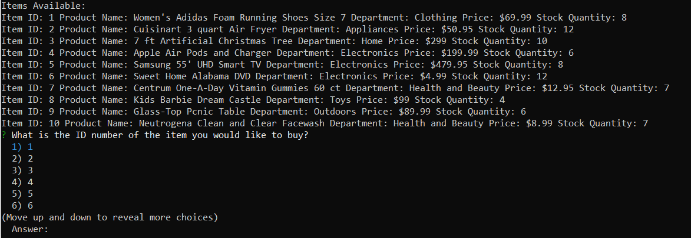
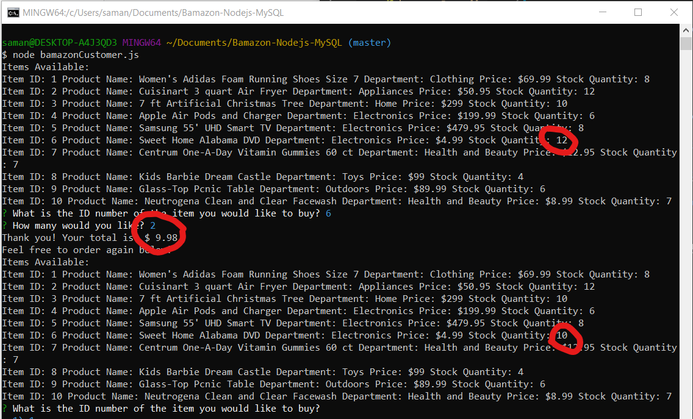

# Bamazon-Nodejs-MySQL

## What is it?
Bamazon is a marketplace to buy things through your command line and stored in a MySQL database.

## Getting Started
1. Clone the repository
2. Run an 'npm install' in your terminal
3. Run 'node bamazonCustomer.js' in your terminal

This will bring up your initial view of what is available to purchase.

Select the item id that you wish to purchase and enter how many you would like.

When you're done, you will see your total and will see the stock quantity subtracted by how many you ordered. Feel free to order more!

## Tools Used
* Node.js
* MySQL
* Inquirer NPM package